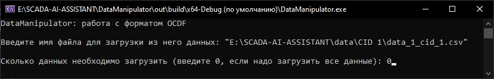
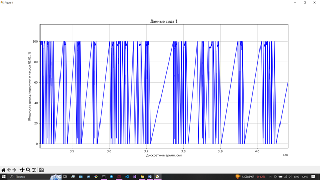

***<h1 align = "center">Data Manipulator</a>***

# Содержание

1) [О DataManipulator](#о-datamanipulator) 
2) [Представление данных](#представление-данных)  
3) [Обработка данных](#обработка-данных)  
    3.1 [Внешний вид меню модуля](#внешний-вид-меню-модуля)  
    3.2 [Чтение данных](#чтение-данных)  
    3.3 [Обрезка данных](#обрезка-данных)  
    3.4 [Выравнивание диапазонов по оси абсцисс](#выравнивание-диапазонов-по-оси-абсцисс)  
    3.5 [Визуализация данных](#визуализация-данных)  
    3.6 [Парсинг данных](#парсинг-данных)  
    3.7 [Сохранение данных](#сохранение-данных)  
4) [Создание TDF-данных](#обработка-данных)  

# О DataManipulator

Модуль DataManipulator предназначен для обеспечения чтения, сохранения и обработки данных. Модуль предоставляет возможности для работы с последовательностями как OCDF-данных, так и TDF-данных. DataManipulator необходим для подготовки данных для работы в модулях анализа таких как Forecaster.

Однако, прежде чем говорить о функциях и возможностях модуля, необходимо понять, с какими форматами данных этот модуль работает.

[В содержание](#содержание)  

# Представление данных

Было решено создать два формата данных. Первый формат предназначается для хранения значений всего одного датчика и обозначается OCDF. Он состоит из трёх значений: номер сида, дискретное время и значение датчика. Однако данный формат также можно использовать и для работы с данными всех сидов, которые подходят под данный формат данных. Тогда значение номера сида будет различаться.  

|cid|time|value|
|---|----|-----|
|1|24|100|
|1|25|99|
|1|30|95|
|1|31|96|

Второй формат представляет собой таблицу данных, где собраны значения всех сидов во времени. Формат обозначается как TDF. Он состоит из семи значений: дискретное время, значение 1-ого сида, значение 2-ого сида, значение 3-ого сида, значение 4-ого сида, значение 5-ого сида, значение 6-ого сида. Данный формат очень легко представить в виде таблицы. 

|time|VC1|VC2|VC3|VC4|VC5|VC6|
|----|---|---|---|---|---|---|
|100|100|23|43|45|65|33|
|102|100|34|41|43|78|45|
|104|99|23|43|45|65|47|
|106|34|12|14|3|54|34|

VCX - value of cid X 

[В содержание](#содержание)  

# Обработка данных

DataManipulator имеет различные функции для обработки данных формата OCDF и TDF, для сборки данных TDF формата, а также для сохранения данных в текстовом или бинарном виде. Ниже будет полностью развёрнуто меню функций и возможностей модуля. 

Главное меню:  
1) Работа с OCDF-форматом.  
    1.1 Обрезка заданного процента данных.  
    1.2 Обрезка заданного количества данных.  
    1.3 Выравнивание диапазонов по оси времени.  
    1.4 Визуализация данных.  
    1.5 Парсинг данных по сиду.  
    1.6 Добавление новых данных.  
    1.7 Сохранение данных в csv-файл.  
    1.8 Сохранение данных в bin-файл.  
    1.9 Выход в главное меню.  
2) Работа с TDF-форматом.  
    2.1 Обрезка заданного процента данных.  
    2.2 Обрезка заданного количества данных.  
    2.3 Визуализация данных.  
    2.4 Парсинг данных по сиду.  
    2.5 Добавление новых данных.  
    2.6 Сохранение данных в csv-файл.  
    2.7 Сохранение данных в bin-файл.  
    2.8 Выход в главное меню.  
3) Сборка TDF-формата из общего файла OCDF-формата.  
4) Информация о модуле.  
5) Выход из программы.

## Внешний вид меню модуля:

Главное меню:  

  

Меню для работы с OCDF-данными:  

  

Меню для работы с TDF-данными:  

  

## Чтение данных

Чтение данных происходит, когда выбивается 1-ый, 2-ой и 3-ий пункт главного меню. Да, перед тем как перейти к обработке данных выбранного формата, эти данные необходимо считать. При чтении данных будет возможность указать имя файла, из которого будут считываться данные, и количество данных, которые нужно считать. Если же необходимо считать все данные, то можно просто ввести 0 - этакое магическое число, при вводе которого функция понимает, что надо считать все данные. При этом, если ввести число, превышающее количество данных в файле, то считаются просто все данные.

Пример чтения OCDF-данных (1-ый пункт меню):  

Пример чтения TDF-данных (2-ый пункт меню):  

Как можно заметить, функции чтения способны различать текстовые и бинарные форматы и считывать данные в соответствующем режиме.

Результат чтения данных можно увидеть в меню для работы с OCDF или TDF данными. Там будет указан тип формата данных, размерность последовательности данных, а также будут выведены первая и последняя строки последовательности данных.

На счёт 3-его пункта главного меню. Функция чтения вызывается для считывания общего OCDF-файла. А что такое общий OCDF-файл? Это файл, данные которого хранятся в формате OCDF и содержит в себе данные всех шести сидов.  

## Обрезка данных

На данный момент имеется возможность обрезать данные и сохранить некоторых их диапазон. Обрезать данные можно указав их количество, которое необходимо оставить, либо процент данных, сколько необходимо оставить. 

Пример обрезки по заданному проценту:

Как можно заметить, программа предлагает возможность обрезать данные либо слева направо, либо справа налево. Это сделано для того, чтобы было удобно делить данные на обучающий и зарезервированные наборы данных. 

Пример обрезки по заданному количеству данных:

Данные функции работают как с OCDF, так и с TDF форматом. 

## Выравнивание диапазонов по оси абсцисс

Данная функция позволяет сделать расстояние от точек временного ряда по оси абсцис равным друг другу. Это достигается путём аппроксимации недостоющих точек по различным методам. 

Эта функция необходима для корректного прогнозирования временных рядов.

На данный момент используется только один метод, который использует аналитическую геометрию для аппроксимации недостоющих точек:

  

И так, чтобы найти недостоющую точку, нам необходимо найти параметры абсциссы и орлинаты. Чтобы найти параметр абсциссы воспользуемся следующим выражением: 

  

Начальный момент времени это значение времени первого элемента последовательности данных. А расстояние между точками по оси абсцисс вводится с клавиатуры.

Теперь найдём y:  

  

Данная функция применима только для данных OCDF формата, поскольку TDF-данные являются аккуратными и для каждого момента времени значения каждого из датчиков определены. 

## Визуализация данных

Визуализация данных выполняется с помощью python-модулей, находящихся в папке ..\PyVisualisation. Модуль предоставляет возможность визуализировать данные как OCDF, так и TDF формата. Примеры:

### Визуализация данных OCDF формата с одним сидом

Как можно увидеть, модуль предоставляет информативные графики. Ось абсцисс подписана и обозначает дисректное время, измеряемое в секундах. Ось ординат для каждого сида своя. То, как подписать ось ординат программа решает на основе переданных модулю данных определённого сида. В свою очередь номер сида указывается в заголовке графика.  

### Визуализация данных OCDF формата с несколькими сидами

Как известно, в файлах OCDF формата могут быть данные разных сидов. Но и с такой проблемой модуль способен разобраться. Пример: 

В заголовке можно уже видеть, что указаны номера двух сидов, но информации у оси ординат о них уже нет. Информация о сидах выводится в легенде в левом верхнем углу визуализации. 

### Визуализация TDF формата

В заголовке можно уже видеть, что указаны номера двух сидов, но информации у оси ординат о них уже нет. Информация о сидах выводится в легенде в левом верхнем углу визуализации. 

### Управление визуализацией

Имеется возможность масштабирования полученных изображений. Ниже перечислены комбинации для регулирования масштаба в окне визуализации:

Вращение колёсика мыши (далее КМ):  

1. вращение вверх КМ (ввКМ) - позволяет приблизить изображение (уменьшить масштаб).

2. вращение вниз КМ (внКМ) - позволяет отдалить изображение (увеличить масштаб).

3. Shift + вращение КМ - позволяет расширить/сузить изображение по ширине (увеличить/уменьшить масштаб по оси абсцисс).

4. Ctrl + вращение КМ - позволяет расширить/сузить изображение по высоте (увеличить/уменьшить масштаб по оси ординат).

## Парсинг данных

Имеется возможность распарсить общие OCDF-данные или OCDF-данные с более чем одним сидом, а также TDF-данные по заданному сиду. В случае парсинга OCDF-данных, после выполнения операции работа с данными будет продолжаться с отпаршеным по сиду набором данных. А в случае парсинга TDF-данных, после выполнения операции будет предложено сохранить отпаршенную последователоьность данных и дальше работать с исходными TDF-данными. 

## Добавление данных

Функция добовления данных позволяет пополнить имеющуюся последовательность данных другими данными того же типа. Для этого необходимо просто ввести имя файла, из которого необходимо будет загрузить данные, и данные пополнят уже имеющуюся последовательность.

## Сохранение данных

Обработанные данные можно сохранить либо в текстовом виде, либо в бинарном виде. Для этого достаточно выбрать соответствующий пункт меню. 

[В содержание](#содержание)  

# Сборка TDF-формата

Данный формат собирается из файла, который содержит в себе все сиды и подходит под формат OCDF-данных. При сборке данных, возникает проблема того, что в некоторые моменты времени не определены значения для некоторых датчиков. Это выглядит следующим образом:

|time|VC1|VC2|VC3|VC4|VC5|VC6|
|----|---|---|---|---|---|---|
|100|100||||||
|103|||41||||
|105||23||||
|110||||||34|

Для решения данной задачи необходимо выполнить следующие действия: определить, данные какого сида появляются позже остальных и обрезать данные других сидов до первого момента времени появления позднейшего сида. Второй шаг похож на первый, но теперь работаем с концами последовательностей. Необходимо определить самый ранний заканчивающийся сид и обрезать концы других сидов до момента окончания самого раннего сида. Далее необходимо воспользоваться функцией выравнивания диапазонов по оси времени для каждой цепочки OCDF-данных. Это необходимо, чтобы в таблице не было пустых ячеек. Далее склеиваем все последовательности в TDF-формат. Пример таких данных уже был показан выше.

[В содержание](#содержание)  
